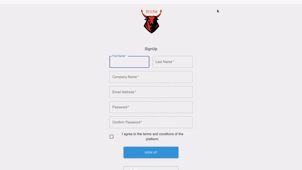
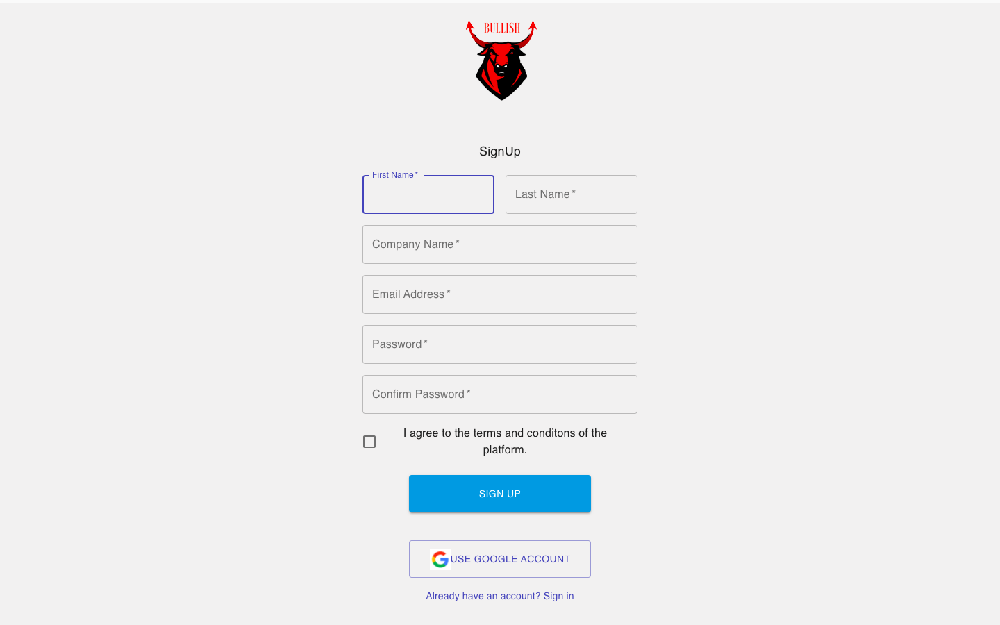
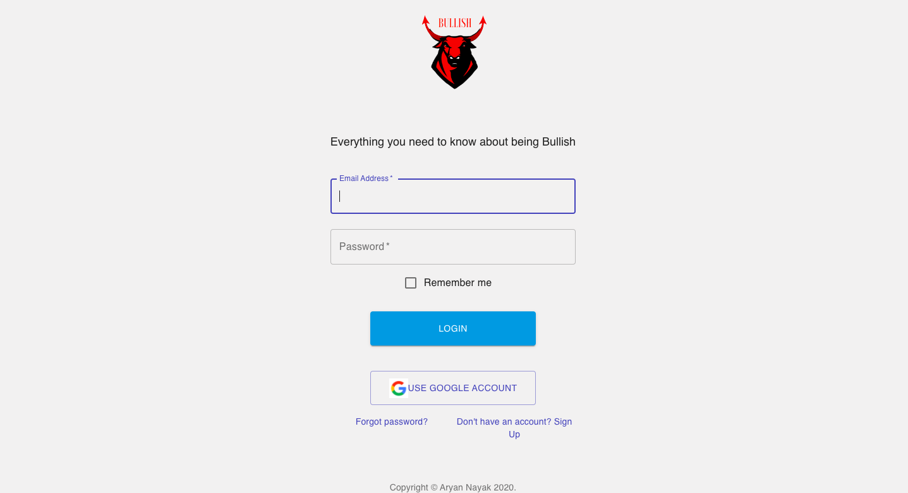
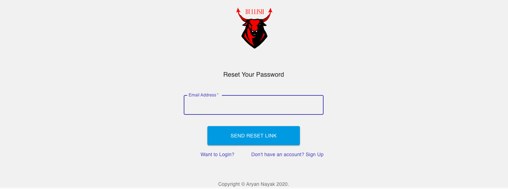
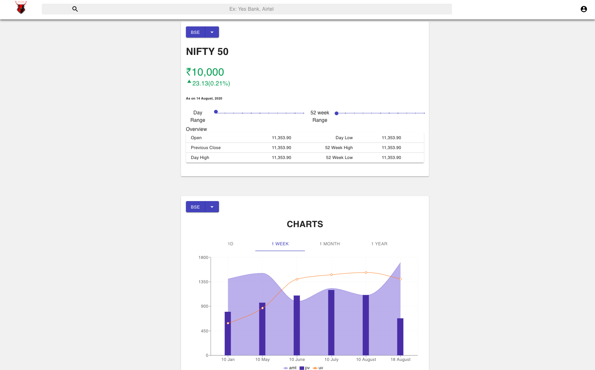

# Market Index Webapp

This project was bootstrapped with [Create React App](https://github.com/facebook/create-react-app).

It is a React App which lets you see the NSE/BSE Indexes with the charts which help you show the growth of the Index in intervals. 

# To run this App

### Step 1: Clone the Repository

### Step 2: "yarn install" 

### Step 4: Download the required Libraries:

#### 1. "yarn add @material-ui/core"

#### 2. Other Dependencies accoring to the System 

### Step 3:

#### Available Scripts

In the project directory, you can run:

#### `yarn start`

Runs the app in the development mode. 
Open [http://localhost:3000](http://localhost:3000) to view it in the browser.

# Checkout the Website

# Sign Up Page
https://gifted-yalow-c3cb09.netlify.app/#/

# Login Page
https://mystifying-bartik-de74b0.netlify.app

# Forgot Password
https://distracted-spence-c854bf.netlify.app/#/

# Main Index Page
https://eager-murdock-fbc41a.netlify.app/

